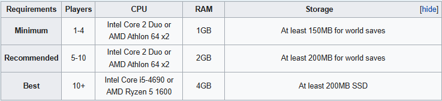

# Minecraft Server Deployment on GCP (Java Edition)

This repository contains the necessary Terraform scripts to deploy a **Minecraft Java Edition Server** on Google Cloud Platform (GCP). It is designed to simplify the process, making it accessible for both beginners and experienced DevOps professionals.

## Prerequisites

Before you begin, ensure you have the following:

1. **Google Cloud Platform Account**:
   - A GCP project set up.
   - Billing enabled for the project.
2. **Terraform Installed**:
   - [Install Terraform](https://developer.hashicorp.com/terraform/downloads).
3. **Google Cloud SDK**:
   - [Install Google Cloud SDK](https://cloud.google.com/sdk/docs/install).
   - Authenticate by running:
     ```bash
     gcloud auth login
     gcloud auth application-default login
     ```
4. **Minecraft Requirements**
    - By default `e2-medium` is deployed with 2 Core and 4GB RAM - that good for 5-10 players cost of 25-30$ Price per month.
    - You can change the instance_type for batter one if you have bigger amount of players.
    - Here the Minecraft Requirements-

      
    - ⚠️ Make sure you update the amount of RAM of the Minecraft server as you use bigger VM.
    - Edit `setup_minecraft_server.sh` at DATA folder
    - At `setup_minecraft_server.sh` line 10
      - `JAVA_RAM="3G"` Change for 4G/6G/8G/16G
5. **Terraform Variables File**:
   - Create a `terraform.tfvars` file in the root of this repository. Example content:
     ```hcl
     prefix          = "tf"
     project_id      = "your-project-id"
     region          = "us-central1"
     zone            = "us-central1-a"
     subnet_cidr     = "10.0.0.0/24"
     billing_account = "your-billing-account-id"
     instance_type   = "e2-medium"
     allowed_range   = ["0.0.0.0/0"]
     ```
     Replace `your-project-id` and `your-billing-account-id` with your GCP project and billing account information.
6. **Minecraft user uuid- Ops**:
    - Ops UUID for Manage your Server 
    - Find you UUID at [MCUUID](https://mcuuid.net/)
    - Edit `setup_minecraft_server.sh` at DATA folder
    - At `setup_minecraft_server.sh` line 41
        ```bash
        # Create OPS
        echo "Update OPS.."
        echo "[
                {
                    "uuid":"your-uuid",
                    "name":"your-username",
                    "level":4
                } 
            ]" | sudo -u $MINECRAFT_USER tee $MINECRAFT_DIR/ops.json
        ```
    - Add your ops with "," between them. 

## Deployment Steps

### 1. Clone the Repository

Clone this repository to your local machine:
```bash
git clone https://github.com/Levi-Michael/GCP-Minecraft-Server.git
cd GCP-Minecraft-Server
```

### 2. Initialize Terraform

Run the following command to initialize Terraform and download the required providers:
```bash
terraform init
```

### 3. Review the Terraform Plan

Preview the infrastructure changes that Terraform will apply:
```bash
terraform plan
```

Ensure the output matches your expectations and there are no errors.

### 4. Apply the Terraform Configuration

Apply the configuration to create the Minecraft server instance:
```bash
terraform apply
```

Type `yes` when prompted to confirm.

### 5. Retrieve the Server's Public IP

Once deployment is complete, Terraform will output the public IP address of the Minecraft server. Note this IP address, as players will use it to connect to your server.

Example output:
```
Apply complete! Resources: 4 added, 0 changed, 0 destroyed.

Outputs:
server_ip = "34.123.45.67"
```

### 6. Connect to Your Minecraft Server

1. Launch the **Minecraft Java Edition** client.
2. Go to **Multiplayer** > **Add Server**.
3. Enter the server IP address retrieved from the Terraform output, The port for the server is 25565.
4. Join the server and enjoy!

## Notes

- **Security Considerations**:
  - The `allowed_range` variable in `terraform.tfvars` defines the IP range allowed to connect to the server. By default, it is set to `0.0.0.0/0`, allowing connections from anywhere. For better security, restrict this range to specific IP addresses.
- **Server Customization**:
  - This deployment focuses on default settings. To customize the server (e.g., mods or plugins), SSH into the instance and modify the server files as needed.
- **Cost Management**:
  - Be mindful of GCP costs. Delete resources when not in use by running:
    ```bash
    terraform destroy
    ```

## Troubleshooting

- **Authentication Errors**:
  Ensure you are authenticated with GCP using the `gcloud auth` commands listed above.
- **Billing Issues**:
  Verify your billing account is linked to your project.
- **Instance Issues**:
  Use the GCP Console to inspect the instance and view logs for troubleshooting.

## Outputs

The following outputs will be generated after a successful deployment:

- `server_ip`: The public IP address of your Minecraft server.
- Instance details such as type, region, and zone can be verified in the GCP Console.

## Disclaimer

This project is intended for educational purposes. Ensure compliance with GCP terms of service and monitor your usage to avoid unexpected charges.


